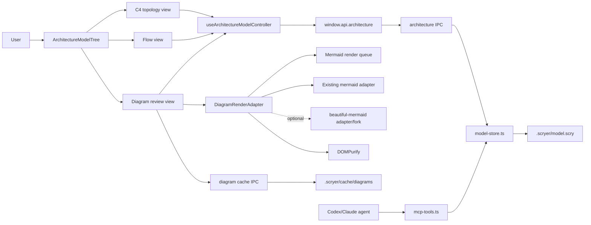

# Scryer Diagram Library Architecture

日期：2026-05-26

术语以 `docs/contracts/2026-05-26-scryer-diagram-library-terminology.md` 为准。本文中的 `Backend/API` 指 Electron main process、`architecture:*` IPC、Scryer MCP tools、model-store 和 cache service；不指传统 HTTP 后端。

关键导出函数、组件 props、MCP handler、cache IPC 的输入输出以 `docs/contracts/2026-05-26-scryer-diagram-library-implementation-contracts.md` 为准。错误码以 `docs/contracts/2026-05-26-scryer-diagram-library-error-codes.md` 为准。本文只说明模块边界和代码归属，不替代函数级契约。

## Existing-system analysis

| Area | Existing behavior/pattern | New feature implication |
|---|---|---|
| 前端入口 | `ArchitecturePanel` 根据 `architectureMode` 在 topology、flows、groups 间切换。 | 需要新增 `architectureMode: 'diagram'` 的 Diagram review view 状态，不能把 diagram 塞进 C4 canvas。 |
| 左侧树 | `ArchitectureModelTree` 只显示 `Model tree` 和 `Flow tree`。 | 需要新增 `Diagram library`，并支持按图类型分组和编号。 |
| C4 canvas | `ArchitectureCanvas` 只消费 `nodes` 和 `edges`。 | 保持不变；diagram 不进入 C4 canvas 的 node/edge 渲染。 |
| Flow 页面 | `FlowScriptView` 编辑 `flows`，并通过 `sourceMap` 关联测试/代码。 | 需要支持 flow 和 flow step 引用 diagram。 |
| 检查面板 | `ArchitectureContextPanel` 支持 node、edge、group、contract、sourceMap。 | 需要新增 diagram reference 管理区。 |
| 前端状态 | `useArchitectureModelController` 集中管理模型、选择、undo/redo、sync。 | 需要把 selected diagram、diagram CRUD、diagramRefs 纳入同一控制器。 |
| Backend/API | `src/main/ipc/architecture.ts` 暴露 read/write model、prompt、sync、MCP tool。 | 现有 read/write model 可继续保存 diagram；新增 S7A cache IPC，导出功能在 S7B 复用该 cache IPC 和前端导出工具。 |
| 持久化 | `model-store.ts` 读写 `.scryer/<model>.scry`，`parse-model.ts` 规范化 JSON。 | `.scry` 新增 top-level diagram 字段，旧文件自动补空数组。 |
| MCP | `mcp-tools.ts` 支持 C4、sourceMap、flows、groups。 | 需要新增 diagram 工具，AI 才能可靠维护图。 |
| Drift/sync | `drift.ts` 基于 sourceMap 文件变化判断漂移；sync prompt 只要求更新 C4/flow/group。 | 需要把 diagramRefs 的 source target 纳入漂移提示，并要求 sync 同步更新 diagram。 |
| Database/data | Orca 有 `better-sqlite3`，但 Architecture 模型不走 SQLite。 | diagram 正文不进 SQLite；`.scry` 是 source of truth，缩略图使用 derived cache 文件。 |

## Technology stack confirmation

| Area | Existing choice | Requirement pressure | Decision | Reason | Risk/tradeoff |
|---|---|---|---|---|---|
| Language/runtime | TypeScript, React, Electron main/preload/renderer | 需要融入 Orca Architecture | 继续使用现有 TypeScript/Electron | 与当前代码一致 | 文件较多，需要严格测试 |
| Package manager/build | pnpm, electron-vite, Vitest, Playwright | 需要新增渲染依赖 | 继续 pnpm | 遵循仓库 | 新依赖需确认打包 |
| Frontend | React 19, Tailwind, lucide, @xyflow/react | 需要图表审查 UI | 新增 React 组件 | 最小适配现有 UI | 状态边界要清楚 |
| Backend/API | Electron IPC + main process service | 需要缓存和 MCP | 复用 `architecture:*` IPC 和 MCP bridge | 不新增 Web server | IPC 契约要测试 |
| Database/data store | `.scryer/*.scry` JSON 文件 | 一个文件管理 C4+flow+diagram | `.scry` 为 source of truth | 符合用户要求 | 大模型文件可能变大 |
| Database/data cache | `orchestration.db` 不承载 Architecture 模型 | diagram 正文必须跟项目走 | 不新增 SQLite schema；使用 `.scryer/cache/diagrams/` derived cache | 避免全局 DB 与项目模型脱节 | 缩略图缓存不能跨机器复用 |
| Mermaid rendering | 当前已有 `mermaid`、`DOMPurify`、`html-to-image` 和 Mermaid render queue | 需要源码+SVG、diagnostics、element info、错误定位 | 新增 `DiagramRenderAdapter`；默认 adapter 复用现有 Mermaid 渲染链路，`beautiful-mermaid` 只作为能力缺口触发的可选 adapter/fork | 避免重复引入渲染体系，并保留高级能力扩展点 | 需要明确 adapter 能力矩阵 |
| Testing | Vitest + Playwright | 需要 Backend/API、Database/data 和 Live verification 证据 | 单元、IPC、MCP、renderer、E2E 全覆盖 | 符合 full-stack 流程 | 测试量较大 |

## Target architecture

## Data ownership

| Data | Owner | Saved where | Notes |
|---|---|---|---|
| C4 nodes/edges | C4 model | `.scry` | Source of truth. |
| Flows | Flow tree | `.scry` | Source of truth. |
| Diagrams | Diagram library | `.scry` | Source of truth. |
| Diagram refs | Model/flow/code-to-diagram links | `.scry` | Source of truth. |
| Render diagnostics | Derived render output | memory only for v1 implementation | Derived cache，可重建；不写入 `.scry`，不写 sidecar JSON。 |
| SVG/PNG thumbnails | Derived cache | `.scryer/cache/diagrams/` | Derived cache，可删除；由 sourceHash、theme、rendererVersion 判断是否过期。 |
| SQLite | None for this feature | unchanged | 不改 `orchestration.db`。 |

## Frontend component changes

| File/component | Change |
|---|---|
| `ArchitecturePanel.tsx` | 新增 `diagram` view，维护 `activeDiagramId`；所有用户点击先走 `requestArchitectureNavigation(...)`，guard 通过后 S1 切换到 `DiagramSourceDraftView`，S2 后切换到完整 `DiagramReviewView`。 |
| `ArchitectureModelTree.tsx` | 新增 `Diagram library` 列表，按 kind 分组并编号。S1 source-only UI 只在 `enableArchitectureDiagramLibraryPreview` 内部 flag 打开时显示；S2 后才允许默认暴露完整 review 入口。 |
| `useArchitectureModelController.ts` | 实现 `createDiagram`、`renameDiagram`、`updateDiagramSource`、`deleteDiagram`、`createDiagramRef`、`upsertDiagramRefs`、`deleteDiagramRefs`、`selectDiagram`、`requestArchitectureNavigation`、`resolveExternalDiagramReload`，并接入 undo/redo 和真实 model write path。Controller 统一处理 dirty draft navigation guard。 |
| `ArchitectureContextPanel.tsx` | 为 selected node/edge/group 增加 diagram references 管理。 |
| `FlowScriptView.tsx` | 为 flow 和 step 增加 diagram references 展示和操作。 |
| `DiagramSourceDraftView.tsx` | S1 source-only 组件：源码 draft、显式保存、改名、删除；不接受 render adapter，不显示空 SVG、diagnostic、copy/export 或 thumbnail 占位。 |
| `DiagramReviewView.tsx` | S2 新组件：源码、渲染、错误和 draft/reload 状态；必须使用统一 render adapter，不能直接并发调用 `mermaid.render()`。S3/S4 才通过 optional `refActions?: DiagramReviewViewRefActions` 接入引用管理和 target navigation；S7B 才通过 `exportActions?: DiagramReviewViewExportActions` 增加 copy/export controls 和 thumbnail 行为。 |
| `diagram-kind.ts` | 新 shared 纯函数模块，提供 `getMermaidSourceDirective` 和 `detectMermaidDiagramKind`，供 S1 save、S2 renderer 和 S5 MCP 共用；禁止依赖 React、Mermaid renderer、DOMPurify、Electron 或浏览器 API。 |
| `source-targets.ts` | 新 shared 纯函数模块，提供同步 `validateWorkspaceRelativeSourcePattern`，供 parser、UI validation 和 MCP validation 共用；禁止访问 filesystem、glob expansion、Electron、React 或 S7A 授权 helper。 |
| `diagram-renderer.ts` | 新 `DiagramRenderAdapter`，隐藏 existing Mermaid adapter 和 optional `beautiful-mermaid` adapter/fork 的差异；renderer-side `detectDiagramKind` 只能委托 shared `detectMermaidDiagramKind`。 |
| `mermaid-render-queue.ts` | 从现有 `MermaidBlock` 抽出或复用全局 render queue，供 DiagramReviewView 和缩略图批量渲染使用。 |
| `diagram-cache-client.ts` | 新 cache API client，调用 preload IPC；S7A 只提供 typed client/service，S7B 才把 review SVG cache、thumbnail 和 export 接到 UI。 |

Function-level rules：

- `useArchitectureModelController.ts` must expose or internally test the diagram mutation and navigation callbacks named in the implementation contract: `createDiagram`, `renameDiagram`, `updateDiagramSource`, `deleteDiagram`, `createDiagramRef`, `upsertDiagramRefs`, `deleteDiagramRefs`, `selectDiagram`, `requestArchitectureNavigation`, and `resolveExternalDiagramReload`.
- `DiagramSourceDraftView.tsx` is the S1-only source editor. It must not pass a fake `renderAdapter`, fake diagnostics, or no-op copy/export callbacks.
- `DiagramReviewView.tsx` must receive persistence, dirty draft reporting, external reload conflict handling, and navigation behavior through the props defined in the implementation contract. It must not write `.scry` directly.
- `src/shared/scryer/diagram-kind.ts` or equivalent shared module must implement `getMermaidSourceDirective` and `detectMermaidDiagramKind` before S1; renderer and MCP must import that shared module rather than each implementing kind detection separately.
- `src/shared/scryer/source-targets.ts` or equivalent shared module must implement synchronous pure source target pattern validation before S3. Parser must not import filesystem, glob expansion, source opening, or authorization code for source refs.
- `diagram-renderer.ts` must implement the `DiagramRenderAdapter` contract, including wrapper `detectDiagramKind`, `renderDiagram`, and `extractRenderedElements`.
- `diagram-cache-client.ts` must use the cache IPC request/response shapes from the implementation contract; it must not accept arbitrary file paths.

## Backend/API changes

| File/module | Change |
|---|---|
| `model-types.ts` | 新增 Diagram、DiagramRef，以及运行时共享的 DiagramRenderResult、DiagramDiagnostic 类型；render result、`DiagramRenderedElement.svgSelector` 和 diagnostics 不属于 `.scry` 持久化 schema。 |
| `parse-model.ts` | 规范化 diagram、diagramRefs、source ranges、element bindings。 |
| `diagram-kind.ts` | 共享 Mermaid directive 到 `DiagramKind` 的检测逻辑；main process MCP 和 renderer 都可导入。 |
| `source-targets.ts` | 共享 source target pattern 同步校验；main process MCP、parser 和 renderer/controller 都可导入，但不得解析真实文件路径。 |
| `model-store-core.ts` | 空模型和 normalize 增加 diagrams、diagramRefs。 |
| `model-store.ts` | 读写继续走 `.scry`，revision 包含 diagram 字段。 |
| `mcp-tools.ts` | 实现 `handleSetDiagrams`、`handleGetDiagram`、`handleDeleteDiagram`、`handleUpdateDiagramRefs`，并按契约校验引用。 |
| `src/cli/scryer-mcp-server.ts` | 新增 diagram MCP 工具到外部 CLI bridge 的 `TOOL_NAMES`、`toolDescription` 和 `toolInputSchema`。 |
| `architecture.ts` | 新增 `readDiagramCache`、`writeDiagramCache`、`clearDiagramCache` IPC；现有 read/write 自动携带 diagrams。 |
| `architecture-project-auth.ts` | S7A 可新增 thin wrapper，但必须复用 `src/main/ipc/filesystem-auth.ts` 的 allowed roots / registered worktree roots；不得维护第二套授权表。核心导出是 `assertAuthorizedArchitectureProjectPath(projectPath, store)`，供 cache IPC 在解析任何 cache path 前校验项目路径。 |
| source target runtime resolver/open helper | S4 在 S7A 之后新增或复用 runtime source resolver：先调用 shared `validateWorkspaceRelativeSourcePattern`，再调用 `assertAuthorizedArchitectureProjectPath(projectPath, store)`，再做 glob/path resolution 和 source-open delegation。 |
| `src/preload/api-types.ts` | 新增 diagram cache API 类型，保证 renderer 编译期可见。 |
| `src/preload/index.ts` | 暴露 `readDiagramCache`、`writeDiagramCache`、`clearDiagramCache` 到 `window.api.architecture`。 |
| `prompt-diagram-instructions.ts` | S6 新共享模块，唯一导出 `buildDiagramPromptInstructions(...)` 的 diagram prompt 规则文本；`prompts.ts` 和 `rules.ts` 都从这里导入，不能互相导入或各写一套规则。 |
| `prompts.ts` | 必须在现有 prompt 函数中接入 diagram 规则：`initialModelPrompt` 默认跳过 diagram，`nodeFillPrompt` 只允许 scoped node 的必要补充图，`deepModelPrompt` 增加 Diagram recovery，`syncPrompt` 增加 potentially drifted diagrams，`advisorPrompt` 只报告不自动修改。 |
| `rules.ts` | `SCRYER_RULES` / `MCP_INSTRUCTIONS` 说明 C4/flow tree 与 top-level diagrams 的边界，并明确 UML/diagram 不能替代契约；`TASK_INSTRUCTIONS` 说明实现代码时如何读取 linked diagrams，并要求需要源码时调用 `get_diagram`。 |
| `drift.ts` | 增加 diagramRefs 中 source target 的漂移提示。 |

Backend/API function-level rules：

- `parse-model.ts` or a sibling shared module must provide the parser and validation helpers listed in the implementation contract.
- `mcp-tools.ts` must implement one handler per diagram tool with the exact success/failure behavior from the implementation contract.
- `architecture.ts`, `src/preload/api-types.ts`, and `src/preload/index.ts` must expose the same cache IPC surface. Updating only main process is incomplete.
- Cache IPC must call `assertAuthorizedArchitectureProjectPath(projectPath, store)` before resolving `.scryer/cache/diagrams`; current Architecture read/write model IPC cannot be cited as an existing reusable authorization helper until it has been migrated. The helper must wrap `src/main/ipc/filesystem-auth.ts` and derive authorization from existing allowed roots / registered worktree roots, not from renderer-provided `projectPath` or a prior readModel call.
- Trusted registration entry points remain `repos:create` in `src/main/ipc/repos.ts` after successful `store.addRepo(repo)` and `worktrees:list`, `worktrees:listAll`, `worktrees:listDetected` in `src/main/ipc/worktrees.ts` where current code already calls `rememberLocalWorktreeRoots(...)` / `registerWorktreeRootsForRepo(...)`. Cache IPC must fail with `cache.unauthorized-project` for paths not allowed by `filesystem-auth.ts`.
- Any implementation that returns success without changing the real `.scry` file or real cache path required by the operation is a contract violation.

## DiagramRenderAdapter and optional `beautiful-mermaid`

默认实现必须先复用 Orca 现有 Mermaid 渲染链路：`mermaid` 负责渲染，DOMPurify 负责 SVG 清理，`html-to-image` 负责 PNG 导出，统一 render queue 负责避免 Mermaid 并发渲染问题。

`beautiful-mermaid` 不是默认必选依赖。只有当 existing Mermaid adapter 无法满足下表中的能力，并且没有更小的本地适配方案时，才引入或 fork `beautiful-mermaid`。这样可以避免重复维护两套渲染体系。

| Need | Required capability |
|---|---|
| `architecture-beta`、`gitGraph`、`C4Context` | Adapter 能识别支持状态；支持时输出 SVG，不支持时返回结构化 diagnostic。 |
| SVG 节点点击 | Adapter 能生成或映射稳定 `elementKey`，并由 UI 使用 delegated click listener 进入 target navigation。一个 elementKey 只有一个唯一目标时直接定位；多个目标时显示 picker，不自动猜。 |
| 源码行号对应 | Adapter 能返回 source range；不能精确定位时必须明确标记为 unavailable，不能伪造行号。 |
| 更细错误定位 | diagnostics 返回 line、column、message、severity；parser 无法提供时返回 message-only diagnostic。 |
| PNG/SVG/缩略图 | SVG 必须先 sanitize；PNG/thumbnail 从当前 SVG 生成并写入 Derived cache。 |

Adapter contract：

- `renderDiagram(diagram, options)` 返回 `DiagramRenderResult`，不得直接写 `.scry`。S2 runtime review passes a transient diagram whose `source` is the local draft source; S7B cache/export only uses a clean persisted source render.
- `sourceHash`、`rendererVersion`、theme 和 notation 只能作为 cache key 输入；具体算法必须使用 contract doc 的 `Hash and cache key rules`，不能在 renderer、prompt 或 cache IPC 各写一套。
- Adapter 必须串行化 Mermaid 渲染调用，或复用 `mermaid-render-queue.ts`。
- Adapter 不允许把 raw SVG event handler 注入 DOM；SVG 点击必须由 React 层事件委托读取 `data-diagram-element-key`，不能依赖 `onclick`。
- Capability matrix 的支持状态必须由 S2 的真实 adapter tests 证明；不能只根据 Mermaid 文档或依赖版本推断支持。

Capability matrix：

| DiagramKind | Existing Mermaid adapter default | Completion rule |
|---|---|---|
| `flowchart` | Supported | Must render before feature is complete. |
| `sequence` | Supported | Must render before feature is complete. |
| `class` | Supported | Must render before feature is complete. |
| `state` | Supported | Must render before feature is complete. |
| `er` | Supported | Must render before feature is complete. |
| `gantt` | Supported by Mermaid, verify locally | Must either render or return unsupported diagnostic with test evidence. |
| `journey` | Supported by Mermaid, verify locally | Must either render or return unsupported diagnostic with test evidence. |
| `gitGraph` | Supported by Mermaid, verify locally | Must either render or return unsupported diagnostic with test evidence. |
| `mindmap` | Supported by Mermaid, verify locally | Must either render or return unsupported diagnostic with test evidence. |
| `timeline` | Supported by Mermaid, verify locally | Must either render or return unsupported diagnostic with test evidence. |
| `requirement` | Supported by Mermaid, verify locally | Must either render or return unsupported diagnostic with test evidence. |
| `quadrant` | Supported by Mermaid, verify locally | Must either render or return unsupported diagnostic with test evidence. |
| `xy` | Supported by Mermaid, verify locally | Must either render or return unsupported diagnostic with test evidence. |
| `architecture` | Depends on Mermaid `architecture-beta` support | Must not introduce `beautiful-mermaid` until existing Mermaid support is tested and found insufficient. |
| `c4` | Depends on Mermaid C4 support | Must not introduce `beautiful-mermaid` until existing Mermaid support is tested and found insufficient. |
| `block` | Depends on Mermaid version support | Must return clear unsupported diagnostic if not available. |
| `packet` | Depends on Mermaid version support | Must return clear unsupported diagnostic if not available. |
| `kanban` | Depends on Mermaid version support | Must return clear unsupported diagnostic if not available. |
| `other` | Unknown | Must return unsupported diagnostic unless adapter can detect a supported Mermaid type. |

Kind detection rules：

- The first meaningful Mermaid directive is the parsing authority. Detection must skip UTF-8 BOM, blank lines, Mermaid `%%` comments, Mermaid init directives, and YAML frontmatter before reading the directive.
- Directive mapping is defined only in the system contract. Examples: `classDiagram` -> `class`, `stateDiagram-v2` -> `state`, `erDiagram` -> `er`, `architecture-beta` -> `architecture`, and `C4Context`/`C4Container`/`C4Component` -> `c4`.
- `Diagram.kind` is a UI grouping/filtering field. Rendering an unsaved draft may show a non-blocking kind-conflict warning, but it must not persist the kind.
- If `Diagram.kind` conflicts with source kind, render using source kind and show a non-blocking warning that `Diagram.kind` will be normalized only on explicit Save.
- Explicit Save of valid source updates `Diagram.kind` to the detected source kind in the same model write as the source update. Invalid source never changes `Diagram.kind`.
- Do not infer source kind from filename, diagram name, or tags.

## Standalone `scryer/` impact

本阶段 standalone `scryer/` 的范围只包含数据兼容，不包含 Diagram library UI。只要 standalone `scryer/` 仍作为仓库内可运行产品，它读取和保存同一个 `.scry` 时不能丢失 `schemaVersion`、`diagrams` 或 `diagramRefs`。

| Area | Expected change |
|---|---|
| `scryer/src/types.ts` | 同步 schemaVersion、Diagram、DiagramRef 类型。 |
| `scryer/src/hooks/useModelStorage.ts` | 读写并保留 diagrams、diagramRefs。 |
| `scryer/crates/scryer-core/src/lib.rs` | Rust 侧显式新增 schemaVersion、Diagram、DiagramRef 字段，并用 flatten extra map 保留兼容的未知 top-level 字段。 |
| `scryer/crates/scryer-core/src/rules.rs` | 同步建模规则。 |

Orca 是当前主要实现目标；standalone 同步不能影响 Orca 的 IPC、MCP 和 agent 集成设计。但只要 standalone 仍被支持，数据兼容不是可选项。Standalone Diagram library UI 是后续独立范围，不能被 S8 偷偷实现或作为 S8 完成条件。

Standalone preservation rule：

- This feature chooses the explicit-plus-preserve strategy, not an implicit best-effort strategy.
- Rust structs must explicitly include `schemaVersion`, `diagrams`, and `diagramRefs` with serde defaults that match TypeScript parser defaults.
- Rust structs must also add `#[serde(flatten)] extra: serde_json::Map<String, serde_json::Value>` or an equivalent top-level unknown-field preservation field so compatible future fields round-trip.
- If standalone encounters a v2 `.scry` but cannot preserve these fields safely, standalone save must be blocked with a clear error until the Rust schema is updated.
- Compatibility tests must cover Orca -> standalone open/save -> Orca reopen with JSON-level confirmation that `schemaVersion`, `diagrams`, `diagramRefs`, and compatible unknown top-level fields remain present.
