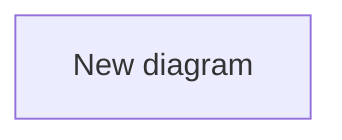

# Scryer Diagram Library Contracts

日期：2026-05-26

术语以 `docs/contracts/2026-05-26-scryer-diagram-library-terminology.md` 为准。本文中的 `API contract` 指 Electron IPC contract 和 MCP tool contract；不默认指 HTTP API。

关键导出函数、组件 props、handler、cache IPC 的实现级输入输出，见 `docs/contracts/2026-05-26-scryer-diagram-library-implementation-contracts.md`。统一错误码见 `docs/contracts/2026-05-26-scryer-diagram-library-error-codes.md`。需求追踪关系见 `docs/contracts/2026-05-26-scryer-diagram-library-traceability.md`。如果本文和 implementation contract 对同一实现细节有冲突，先停止编码并更新文档，不允许静默选择一种写法。

## Business rules

| ID | Condition | System behavior |
|---|---|---|
| BR1 | 用户打开旧 `.scry` 文件，没有 `diagrams` 字段。 | 系统显示空 Diagram library，并在保存时写入规范化结构。 |
| BR2 | 用户点击 C4 model tree 节点。 | Architecture 主内容区显示 C4 canvas；diagram 不进入 ReactFlow nodes/edges。 |
| BR3 | 用户点击 flow tree 项。 | Architecture 主内容区显示 FlowScriptView。 |
| BR4 | 用户点击 diagram 项。 | Architecture 主内容区进入 Diagram review view，保留 C4 model tree 数据不变。S1 只显示 `DiagramSourceDraftView` 源码编辑壳；S2 后显示完整 `DiagramReviewView`。 |
| BR5 | diagram source 无法渲染。 | 显示错误，不删除源码，不覆盖上一次用户输入。 |
| BR6 | 用户通过 Orca UI 或 MCP 删除 C4 node/edge/group/flow/step/diagram。 | 必须按 `DiagramRef deletion policy` 清理相关 refs；parser 只报告外部坏数据，不在读取时静默删除。 |
| BR7 | AI/MCP 创建 diagram。 | 必须写入 top-level `diagrams`，不能创建 fake C4 node。 |
| BR8 | AI/MCP 更新 C4 节点对应代码。 | 必须检查并更新相关 diagramRefs 指向的 diagrams。 |
| BR9 | 用户导出 PNG 或复制 SVG。 | 使用当前源码和主题渲染结果；导出失败显示错误。 |
| BR10 | 缩略图缓存缺失或过期。 | 重新渲染并写入缓存；缓存不能改变 `.scry` 真相。 |
| BR11 | 用户或 MCP 打开旧 `.scry` 文件，没有 `schemaVersion`。 | `parseModelData` 返回规范化 schema v2 model；只读打开不写盘，下一次用户/MCP 保存时才写入 `schemaVersion: 2`。 |
| BR12 | standalone `scryer/` 仍可运行并保存同一个 `.scry`。 | 必须保留 Orca 写入的 `schemaVersion`、`diagrams`、`diagramRefs`；不能在保存时丢字段。 |
| BR13 | 同一代码位置既出现在 `sourceMap` 又出现在 `diagramRefs.target.type === 'source'`。 | `sourceMap` 继续表示 C4/flow 到代码的实现映射；source diagramRef 只表示 diagram 到代码证据的引用，二者不能互相替代。 |
| BR14 | 用户在 DiagramReviewView 有未保存 draft 时切换 C4、flow、diagram、model 或关闭 view。 | 必须显示固定选择：Save and switch、Discard and switch、Cancel；保存失败时停留在当前 diagram 并保留 draft。 |
| BR15 | 用户保存或打开无效 Mermaid source。 | source 可以保存，但 render pane 必须显示 invalid/stale 状态；S2 不显示 copy/export，S7B 显示后必须禁用；不得把旧 SVG 当成当前源码的有效渲染。 |
| BR16 | 用户创建 DiagramRef。 | 默认从目标对象侧选择已有 diagram 和 role；element-level ref 只能绑定 adapter 返回的稳定 `elementKey`，不能让用户保存不稳定 DOM selector。 |
| BR17 | 用户点击一个被多个 C4、flow 或 source 引用的 SVG element。 | 不自动猜目标；必须显示目标选择器。只有当该 element 只有一个可导航目标时才直接跳转。 |

## `.scry` data contract

```ts
export const SCRY_SCHEMA_VERSION = 2

export type DiagramNotation = 'mermaid'

export type DiagramKind =
  | 'flowchart'
  | 'sequence'
  | 'class'
  | 'state'
  | 'er'
  | 'architecture'
  | 'gitGraph'
  | 'c4'
  | 'gantt'
  | 'journey'
  | 'mindmap'
  | 'timeline'
  | 'requirement'
  | 'quadrant'
  | 'xy'
  | 'block'
  | 'packet'
  | 'kanban'
  | 'other'

export type DiagramSourceRange = {
  startLine: number
  startColumn?: number
  endLine?: number
  endColumn?: number
}

export type Diagram = {
  id: string
  name: string
  kind: DiagramKind
  notation: DiagramNotation
  source: string
  description?: string
  tags?: string[]
  updatedAt?: string
}

export type DiagramRefTarget =
  | { type: 'node'; id: string }
  | { type: 'edge'; id: string }
  | { type: 'group'; id: string }
  | { type: 'flow'; id: string }
  | { type: 'flowStep'; flowId: string; stepId: string }
  | { type: 'source'; pattern: string; line?: number; endLine?: number }

export type DiagramRefRole =
  | 'architecture-detail'
  | 'behavior-detail'
  | 'sequence-detail'
  | 'state-detail'
  | 'data-detail'
  | 'class-detail'
  | 'deployment-detail'
  | 'evidence'
  | 'other'

export type DiagramRef = {
  id: string
  diagramId: string
  target: DiagramRefTarget
  role: DiagramRefRole
  elementKey?: string
  sourceRange?: DiagramSourceRange
  note?: string
}

Line and range semantics：

- `DiagramRefTarget.source.line` and `endLine` are 1-based line numbers in the matched code file. They are used when opening the referenced source file.
- `DiagramRef.sourceRange` is the optional 1-based range inside the Mermaid/diagram source that produced or explains this ref. It is never a code-file location.
- If both are present, UI must label them separately as source file location and diagram source location. They must not be merged into one range.

export type C4ModelDataV2 = C4ModelData & {
  /**
   * Added by this feature. Existing C4ModelData fields must be preserved:
   * nodes, edges, startingLevel, sourceMap, projectPath, refPositions,
   * groups, flows, validationWarnings, and any existing compatible fields.
   * `validationWarnings` are preserved in the normalized in-memory model only;
   * serializer output must still omit validationWarnings from disk.
   */
  schemaVersion: typeof SCRY_SCHEMA_VERSION
  diagrams: Diagram[]
  diagramRefs: DiagramRef[]
}
```

规则：

- 这是 additive contract：只能在现有 `C4ModelData` 上追加 `schemaVersion`、`diagrams`、`diagramRefs`，不能删除或重命名现有字段。
- 当前已有字段必须保留，包括 `nodes`、`edges`、`startingLevel`、`sourceMap`、`projectPath`、`refPositions`、`groups`、`flows`、`validationWarnings`。这里的“保留”指 normalized in-memory model 不能丢字段；写回 `.scry` 时仍按现有 serializer 规则省略 `validationWarnings`。
- `parseModelData` 对旧文件返回 normalized `C4ModelDataV2`，因此 renderer/main/MCP 读取到的对象中 `schemaVersion`、`diagrams`、`diagramRefs` 总是存在。
- 只读打开旧 `.scry` 不立刻写盘，避免用户只是浏览模型就产生文件 diff。
- 下一次用户保存、MCP 写入、sync finish 或显式 model write 时，`serializeModelData` 必须写入 `schemaVersion: 2`、`diagrams: []`、`diagramRefs: []`。
- `diagrams` 是图列表；不能放进 `nodes`。
- `diagramRefs` 是关联表；whole diagram 引用时不填 `elementKey`。
- SVG 元素级引用必须填 `elementKey`；如果 adapter 能定位源码，必须同时填 `sourceRange`。
- `sourceRange` 行号从 1 开始。
- `notation` 当前只允许 `mermaid`，未来再扩展 PlantUML 等。
- `updatedAt` is optional only for legacy data. New UI-created diagrams must set it to an ISO 8601 UTC string.
- `.scry` 不保存 SVG、PNG、thumbnail、diagnostics、rendererVersion 或 sourceHash；这些属于 Derived cache 或运行时 render result。
- standalone `scryer/` 如果暂时不实现 Diagram UI，也必须在 parse/save 时保留这些字段，避免 Orca 数据被覆盖丢失。

DiagramRefRole semantics：

| Role | Meaning | Typical target |
|---|---|---|
| `architecture-detail` | 结构补充，例如跨 C4 层级的组件关系。 | node, edge, group |
| `behavior-detail` | 用户流程或业务流程补充。 | flow, flowStep |
| `sequence-detail` | 调用顺序、消息顺序或跨模块协作。 | node, flowStep |
| `state-detail` | 状态机、状态转换、生命周期。 | node, flowStep |
| `data-detail` | 数据结构、ER、数据流或存储关系。 | node, source |
| `class-detail` | 类、接口、继承、组合关系。 | node, source |
| `deployment-detail` | 部署拓扑、运行时依赖、环境边界。 | group, node |
| `evidence` | 图与代码或文档证据的引用。 | source |
| `other` | 以上都不合适时才使用，并且 `note` 必须说明原因。 | any |

DiagramRef creation workflow：

- Target-side creation is the default: selected node、edge、group、flow、flow step 或 source file 面板提供 Add diagram reference。
- The picker must list existing diagrams using the stable Diagram library order. S3 does not create diagrams inline; S3A adds the `Create diagram then link` flow so users can create a diagram from the ref picker without losing the original target.
- In `Create diagram then link`, the UI must keep a pending target, create and explicitly save the new diagram through the S1/S2 save path, then return to role selection for that original target before writing `DiagramRef`.
- UI-created diagrams must never be created with empty source. The Create action must call the controller with a valid default Mermaid source generated for the selected kind; users edit that source afterward through the source draft/save flow.
- If diagram creation or source save fails, no `DiagramRef` is written. If the user cancels after explicitly saving the diagram but before saving the ref, the diagram may remain, but the ref must not be auto-created and the UI must show: "Diagram created, not linked yet." The same message must include a `Link now` action when the original pending target still exists; `Link now` resumes role selection with the saved diagram selected. If the original target no longer exists, `Link now` opens the diagram-side ref picker and shows a target unavailable warning.
- User must choose `role`; the UI may suggest a default role from target type and diagram kind, but it must save the explicit role value.
- Whole-diagram refs save `diagramId` and omit `elementKey`.
- Whole-diagram refs can be many-to-one: one diagram may be referenced by multiple C4 nodes, flows, flow steps, or source files. Opening the diagram from a target-side ref is unambiguous because the clicked target/ref is already known. Inside DiagramReviewView, all inbound whole-diagram refs appear in the reverse reference list; clicking a list row navigates to that exact row's target. Clicking the diagram title or blank render area must not guess one of the whole-diagram refs.
- Element-level refs must be created from DiagramReviewView or from a picker that reads `DiagramRenderedElement[]`; only bindable elements with stable `elementKey` may be selected.
- When creating an element-level ref from SVG, the UI flow is: choose `Bind element` -> enter binding mode -> select/click bindable SVG element -> choose target object/source -> choose role -> save `DiagramRef` with `elementKey`.
- Default SVG click mode is navigation mode: clicking a bound element navigates to its target, and clicking an unbound element does nothing.
- SVG click navigation is target-based, not browser-history-style back navigation. It does not mean "return to the place the user came from"; it means "open the C4 node、edge、group、flow、flow step 或 source location recorded by `DiagramRef.target`".
- When one clicked `elementKey` maps to multiple valid `DiagramRef` targets, the UI must show a target picker and must not auto-select the first ref. The picker must list one row per unique target, grouped in this order: node, edge, group, flow, flowStep, source. Within each group sort by visible label, then target id/pattern, then role, then ref id.
- If several refs point to the same target, the target picker must collapse them into one target row and show the roles/notes under that row. Clicking that row navigates to the target; it does not delete duplicate refs.
- Clicking a row in the diagram-side reverse reference list is always explicit navigation to that row's target. The multi-target picker is only required for direct clicks on the rendered SVG element.
- Binding mode is entered only through an explicit `Bind element` command. In binding mode, clicking a bindable SVG element selects it for ref creation and must not navigate. `Esc`, `Cancel`, or saving the ref exits binding mode.
- `sourceRange` is saved only when the adapter can derive it. The UI must display source location unavailable when no reliable range exists.
- `role: 'other'` requires `note`.

## Migration and validation rules

| Case | Required behavior |
|---|---|
| Missing `schemaVersion` | Treat as v1 in memory, return `schemaVersion: 2`, and write v2 only on the next explicit save. |
| Missing `diagrams` | Return `diagrams: []` in memory; write it on next explicit save. |
| Missing `diagramRefs` | Return `diagramRefs: []` in memory; write it on next explicit save. |
| Duplicate diagram id | Keep first valid diagram and report validation warning for duplicates. |
| Duplicate diagramRef id | Keep first valid ref and report validation warning for duplicates. |
| Ref points to missing diagram | Mark as dangling validation warning; do not silently point it to another diagram. |
| Ref target deleted by explicit user action | Delete refs according to `DiagramRef deletion policy`. |
| Invalid `flowStep` target | Report dangling warning with `flowId` and `stepId`; do not delete during parse. |
| Invalid `sourceRange` | Keep ref, omit invalid range fields from normalized model, and report warning. |

Normalization rule：

- Parser normalization may drop invalid transient fields, but it must not rewrite the file during read.
- Validation warnings must identify `diagramId`, `diagramRefId`, target type, and target id/path where possible.
- Serializer must omit `validationWarnings` from disk the same way current model serialization does.

## DiagramRef deletion policy

| Delete action | Required ref behavior |
|---|---|
| Delete diagram | Delete all `diagramRefs` whose `diagramId` equals the deleted diagram id, then clear that diagram's Derived cache. |
| Delete node | Delete refs targeting `{ type: 'node', id }`; refs targeting source files are not touched. |
| Delete edge | Delete refs targeting `{ type: 'edge', id }`. |
| Delete group | Delete refs targeting `{ type: 'group', id }`; member node refs stay intact. |
| Delete flow | Delete refs targeting `{ type: 'flow', id }` and all `{ type: 'flowStep', flowId: id, ... }`. |
| Delete flow step | Delete refs targeting that step and refs for all nested branch steps under it. |
| Delete source file outside Orca | Keep source refs. Parser does not check file existence; S4 source opening returns `controller.source-open-failed` with `reason: 'no-matches'`, and S6 drift may report `source-target-missing`. |
| Parser reads dangling ref from external edit | Keep the ref, report validation warning, and let user/MCP fix it explicitly. |

Flow step target rules：

- `FlowStep.id` must be unique inside one flow, including steps nested under `branches`.
- A `flowStep` target is valid if a depth-first search through `flow.steps` and every nested `branch.steps` finds the `stepId`.
- Moving a step keeps refs valid because refs use stable `flowId + stepId`, not array index.
- Deleting a flow deletes refs for that flow and all nested steps.
- Deleting a step deletes refs for that step and every nested branch step below it.

## Render result contract

```ts
export type DiagramErrorCode =
  | `parser.${string}`
  | `renderer.${string}`
  | `controller.${string}`
  | `cache.${string}`
  | `mcp.${string}`
  | `bridge.${string}`
  | `standalone.${string}`

export type DiagramDiagnostic = {
  severity: 'error' | 'warning'
  code: DiagramErrorCode
  message: string
  line?: number
  column?: number
  endLine?: number
  endColumn?: number
}

export type DiagramRenderedElement = {
  elementKey: string
  label?: string
  kind?: string
  sourceRange?: DiagramSourceRange
  svgSelector?: string
}

export type DiagramRenderResult =
  | {
      ok: true
      svg: string
      elements: DiagramRenderedElement[]
      diagnostics: DiagramDiagnostic[]
      sourceHash: `sha256:${string}`
      rendererVersion: string
    }
  | {
      ok: false
      diagnostics: DiagramDiagnostic[]
      sourceHash: `sha256:${string}`
      rendererVersion: string
    }
```

规则：

- SVG 注入 DOM 前必须经过 DOMPurify。
- `DiagramDiagnostic.code` is required for this feature and must use the error code matrix. Renderer diagnostics use `renderer.*`; parser-derived diagnostics may use related `parser.*` codes.
- `elements.elementKey` 必须稳定；同一源码同一元素应生成同一 key。
- 不支持的 Mermaid 图类型必须返回 `ok: false` 和清晰 diagnostic。
- `DiagramRenderResult.sourceHash` is the hash of the exact source string rendered for that result. In S2 review this can be the local draft source; it is not automatically the persisted `.scry` source.
- Render result 是运行时结果，不写入 `.scry`。`sourceHash` 和 `rendererVersion` 只能用于 cache key 和过期判断。
- `DiagramRenderResult` and `DiagramRenderedElement` may be shared TypeScript runtime types, but they are not part of the durable `.scry` schema. Serializers must never write `svg`, `diagnostics`, `sourceHash`, `rendererVersion`, `elements`, or `elements.svgSelector` to disk.

Hash and cache key rules：

- `sourceHash` format is `sha256:<64 lowercase hex>`.
- `sourceHash` input is the exact source string passed to `computeDiagramSourceHash`, encoded as UTF-8 after normalizing CRLF/CR line endings to LF. Whitespace inside the source still matters.
- Runtime review render may compute `sourceHash` from unsaved draft source. Prompt serialization, `.scry` summaries, and cache keys must compute it from persisted `Diagram.source`.
- `rendererVersion` format is `mermaid@<version>|adapter@<version>|dompurify@<version>`; if a package version is unavailable, use `unknown` but keep the same field order.
- `cacheKey` format is `sha256:<64 lowercase hex>`.
- `cacheKey` input is canonical JSON with sorted keys for `{ sourceHash, notation, detectedKind, theme, rendererVersion, outputProfile }`.
- `outputProfile` is `review`, `thumbnail`, or `export`; do not include diagram name, description, tags, refs, or UI selection in the cache key.
- If `Diagram.kind` conflicts with the first meaningful Mermaid directive detected by `detectMermaidDiagramKind(source)`, use the detected source kind for `detectedKind`.
- The same helper must generate `sourceHash` and `cacheKey` for renderer, prompt serialization, and cache IPC tests.
- Rendering a local unsaved draft may show a kind-conflict warning, but it must not persist `Diagram.kind`.
- `Diagram.kind` is persisted only on explicit Save after successful kind detection. Invalid source never changes `Diagram.kind`.

Diagram.kind conflict behavior table：

| Path | Required behavior | Persistence rule |
|---|---|---|
| UI draft render with valid source and conflicting stored `Diagram.kind` | Render with the detected source kind and show `renderer.kind-conflict` as a non-blocking warning. | Do not write `.scry`; do not change persisted `Diagram.kind`. |
| UI explicit Save with valid source and conflicting stored `Diagram.kind` | Treat the detected source kind as authoritative. | Save source and normalized `Diagram.kind` in the same model write and undo/redo snapshot. |
| UI explicit Save with invalid source | Preserve user source if the save path allows invalid Mermaid source, and show diagnostics in review. | Never change persisted `Diagram.kind` from invalid source. |
| MCP `set_diagrams` with payload `kind` conflicting with detected source kind | Reject the entire call with `mcp.validation-failed` and details containing `renderer.kind-conflict`. | Do not rewrite the MCP payload and do not write `.scry`. |
| Runtime render/cache key computation | Use detected source kind as `detectedKind` for render result and cache key. | Derived render/cache data remains outside `.scry`. |

Default diagram source rules：

- UI create flows must call `createDiagram` with non-empty source.
- The default new diagram is a valid Mermaid flowchart unless the user explicitly chooses another supported kind.
- Default source for the common path must be:



- If the UI allows selecting another kind before creation, it must use a valid minimal Mermaid template for that kind or fall back to the flowchart template above and store `kind: 'flowchart'`.
- On explicit Save of valid source, if detected source kind differs from stored `Diagram.kind`, save both the source and normalized `Diagram.kind` in the same undo/redo snapshot.
- `detectMermaidDiagramKind(source)` is a shared pure helper, not a renderer-only helper. It must be available before S1 so UI save paths and MCP handlers can normalize or reject source-kind conflicts without importing renderer code.

Mermaid directive detection rules：

| Mermaid directive | DiagramKind |
|---|---|
| `flowchart`, `graph` | `flowchart` |
| `sequenceDiagram` | `sequence` |
| `classDiagram`, `classDiagram-v2` | `class` |
| `stateDiagram`, `stateDiagram-v2` | `state` |
| `erDiagram` | `er` |
| `architecture-beta` | `architecture` |
| `C4Context`, `C4Container`, `C4Component`, `C4Dynamic`, `C4Deployment` | `c4` |
| `gantt` | `gantt` |
| `journey` | `journey` |
| `gitGraph` | `gitGraph` |
| `mindmap` | `mindmap` |
| `timeline` | `timeline` |
| `requirementDiagram` | `requirement` |
| `quadrantChart` | `quadrant` |
| `xychart-beta` | `xy` |
| `block-beta` | `block` |
| `packet-beta` | `packet` |
| `kanban` | `kanban` |

Detection skips a leading UTF-8 BOM, blank lines, Mermaid `%%` comments, Mermaid init directives such as `%%{init: ...}%%`, and YAML frontmatter delimited by `---`. The first remaining directive is authoritative. Unknown directives return `kind: 'other'` plus a `renderer.unsupported-kind` diagnostic when rendering cannot support them.

Element key algorithm：

- `elementKey` must be derived from Mermaid source semantics, not DOM order, React keys, SVG selectors, or rendered element index.
- Preferred shape: `<diagramKind>:<semanticKind>:<stableSourceIdOrLabelHash>`.
- If Mermaid syntax provides an explicit id, use that id after normalization.
- If Mermaid syntax has no explicit id, use a normalized label plus source range hash: `sha256(kind + label + startLine + startColumn)`.
- If neither explicit id nor source range is available, adapter must mark the element as not bindable and omit it from `elements`; it must not invent an unstable key.
- `svgSelector` is only a render-time helper and must never be stored as the durable reference key.
- If a parser or serializer encounters `svgSelector` inside persisted input, it must drop that field from normalized output and never write it back.

SVG click binding rules：

- Durable binding is always `DiagramRef.elementKey`; `svgSelector` must never be saved to `.scry`.
- `renderDiagram` must return sanitized SVG that annotates bindable SVG elements with `data-diagram-element-key="<elementKey>"`.
- Annotation order is: render Mermaid SVG -> derive `DiagramRenderedElement[]` and runtime selectors -> add `data-diagram-element-key` to bindable elements -> sanitize the annotated SVG while allowing only this data attribute plus safe SVG attributes.
- DiagramReviewView must use one delegated click listener on the SVG container and read `event.target.closest('[data-diagram-element-key]')`.
- If an SVG element has no `data-diagram-element-key`, clicking it must do nothing.
- Raw SVG event handler attributes such as `onclick` must be removed by sanitization and are not allowed as a navigation mechanism.

Diagram id, ref id, and library ordering rules：

- UI-created diagram ids must be generated as `diagram-<slug>-<shortid>`.
- `<slug>` is derived from the diagram name by lowercasing ASCII letters, replacing non-alphanumeric runs with `-`, trimming leading/trailing `-`, and falling back to `untitled` when empty.
- `<shortid>` is 8 lowercase base36 characters from `crypto.randomUUID()` or an equivalent cryptographically strong random source; on collision, regenerate until unique.
- MCP-created diagrams must provide explicit `Diagram.id`; MCP handlers reject missing, empty, duplicate, or invalid ids instead of generating them.
- UI-created diagramRef ids must be generated as `diagram-ref-<targetType>-<shortid>` with the same collision handling.
- MCP-created diagramRefs must provide explicit `DiagramRef.id`; MCP handlers reject missing, empty, duplicate, or invalid ids.
- Diagram ids and diagramRef ids must match `[A-Za-z0-9_-]{1,120}`.
- Diagram library kind group order is the `DiagramKind` union order in this contract: `flowchart`, `sequence`, `class`, `state`, `er`, `architecture`, `gitGraph`, `c4`, `gantt`, `journey`, `mindmap`, `timeline`, `requirement`, `quadrant`, `xy`, `block`, `packet`, `kanban`, `other`.
- Inside each kind group, sort by normalized `name` ascending, then `updatedAt` ascending when both exist, then `id` ascending. Use the same comparator in UI, deletion fallback, and tests.
- Numbering restarts inside each kind group after sorting.
- When the active diagram is deleted, select the next diagram in the flattened sorted library order; if the deleted item was last, select the previous item; if no diagrams remain, switch to `topology`.

Diagram library UX rules：

- Empty state: when no diagrams exist, show a small empty state with one Create diagram action. Do not show an empty tree group that looks broken.
- Loading state: while a model reload is pending, keep the previous tree visible when possible and show a loading marker on the Diagram library; do not clear the C4 canvas unless the active selection becomes invalid.
- Error state: if diagram parsing or reload warnings exist, keep valid diagrams visible and show a warning row with the exact `parser.*` code count; one bad ref must not hide the whole library.
- Large-list state: when there are more than 20 diagrams, show a search/filter input and allow kind groups to collapse. Search filters by diagram name, kind, tags, and description only; it must not search full Mermaid source by default.
- Each kind group shows its item count. Collapsed/expanded group state is UI state only and must not be saved to `.scry`.
- A diagram with zero `diagramRefs` is marked `Unlinked` in the library so the user can decide whether to link or delete it.
- After S7B, stale or missing thumbnails must show a neutral thumbnail placeholder plus stale/loading badge; stale thumbnails must not be presented as current render output.

`updatedAt` maintenance rules：

- `createDiagram` sets `updatedAt` to the mutation time.
- `renameDiagram` updates `updatedAt` only when the trimmed name changes.
- `updateDiagramSource` updates `updatedAt` only when the persisted source or persisted `Diagram.kind` changes.
- `upsertDiagramRefs` and `deleteDiagramRefs` do not update `Diagram.updatedAt`; refs changing must not reorder the Diagram library.
- MCP `set_diagrams upsert` preserves a valid provided `updatedAt`; if missing or invalid, the handler writes the mutation time for changed diagrams.
- Parser normalization keeps valid legacy `updatedAt` strings and drops invalid ones with `parser.invalid-updated-at`.

## Source target safety rules

`DiagramRefTarget` with `{ type: 'source' }` must use a project-relative POSIX path or glob pattern. It is a reference to workspace evidence, not an arbitrary local file pointer.

Source target safety has two layers:

- Pure pattern validation is synchronous and filesystem-free. Parser, UI validation, and MCP validation can call it without changing `parseModelData` into an async function.
- Runtime resolution/opening is allowed to touch the filesystem only after the S7A trusted project authorization helper accepts `projectPath`. This layer is used for S4 source navigation/opening, not parser normalization.

Required helper contracts:

```ts
export type SourceTargetPatternValidationResult =
  | { ok: true; normalizedPattern: string }
  | {
      ok: false
      code: 'parser.invalid-source-target' | 'controller.invalid-source-target'
      reason:
        | 'empty'
        | 'absolute'
        | 'windows-drive'
        | 'home-prefix'
        | 'url-scheme'
        | 'nul-byte'
        | 'parent-traversal'
        | 'unsupported-glob'
      rejectedPattern: string
    }

export function validateWorkspaceRelativeSourcePattern(
  pattern: string,
  caller: 'parser' | 'controller'
): SourceTargetPatternValidationResult

export type SourceTargetResolutionResult =
  | { ok: true; authorizedProjectPath: string; normalizedPattern: string; matchedRelativePaths: string[] }
  | {
      ok: false
      code: 'controller.invalid-source-target' | 'controller.source-open-failed'
      reason:
        | 'glob-escape'
        | 'outside-project'
        | 'no-matches'
        | 'unauthorized-project'
        | 'filesystem-error'
      rejectedPattern: string
    }

export type SourceOpenLocation = {
  relativePath: string
  line?: number
  endLine?: number
}

export type SourceTargetRuntimeContext = {
  projectPath: string
  store: Store
}

export function resolveWorkspaceSourcePattern(
  context: SourceTargetRuntimeContext,
  normalizedPattern: string
): Promise<SourceTargetResolutionResult>

export type OpenDiagramSourceTargetResult =
  | { ok: true; action: 'opened'; locations: SourceOpenLocation[] }
  | { ok: true; action: 'selection-required'; locations: SourceOpenLocation[] }
  | {
      ok: false
      code: 'controller.invalid-source-target' | 'controller.source-open-failed'
      reason: string
      rejectedPattern: string
    }

export function openDiagramSourceTarget(
  context: SourceTargetRuntimeContext,
  target: Extract<DiagramRefTarget, { type: 'source' }>
): Promise<OpenDiagramSourceTargetResult>
```

- `pattern` must be non-empty after trimming.
- `pattern` must reject absolute paths, Windows drive prefixes, `~`, URL schemes, NUL bytes, and any `..` segment after POSIX normalization.
- Allowed glob characters are `*`, `**`, and `?`. Unsupported glob syntax is rejected by pure validation.
- `validateWorkspaceRelativeSourcePattern(...)` is the single pure source-target pattern validation helper for parser warnings, UI ref creation, MCP ref creation, and the first step of source opening. It must not open files, expand globs, stat paths, or call project authorization during parser normalization.
- `SourceTargetRuntimeContext.store` is the main-process `Store` needed by filesystem authorization; renderer code never receives or fabricates it.
- `Store` means the existing main-process store type from Orca persistence code. Do not create a renderer-side replacement just to satisfy this contract.
- `resolveWorkspaceSourcePattern(...)` is the runtime resolution helper. It must call `assertAuthorizedArchitectureProjectPath(context.projectPath, context.store)` from S7A before expanding globs or resolving symlinks; every matched path must still resolve inside the canonical authorized project root.
- `openDiagramSourceTarget(...)` must call `validateWorkspaceRelativeSourcePattern(target.pattern, 'controller')`, then `resolveWorkspaceSourcePattern(context, normalizedPattern)`, before opening files. It may delegate to the existing editor/source-open action only after those helpers return `ok: true`.
- Source target matches are sorted by POSIX `relativePath` ascending before UI use.
- If a valid pattern resolves zero files, `openDiagramSourceTarget(...)` returns `{ ok:false, code:'controller.source-open-failed', reason:'no-matches' }`.
- If a valid pattern resolves one file, `openDiagramSourceTarget(...)` opens that file at `target.line/endLine` when provided and returns `{ ok:true, action:'opened', locations:[...] }`.
- If a valid pattern resolves multiple files, `openDiagramSourceTarget(...)` must not open the first match automatically. It returns `{ ok:true, action:'selection-required', locations:[...] }`; UI shows a picker, and the user-selected location is opened with the same `line/endLine`.
- Source target opening must use the same authorized project root as Architecture model/cache operations. It cannot open absolute local paths, URLs, or paths outside the selected Orca project/worktree.
- Parser keeps syntax-unsafe source refs as dangling data with `parser.invalid-source-target`; it must not open, glob-expand, stat, or normalize them to a different path during read.
- Parser only validates source target syntax. It must not report missing source files, because existence requires filesystem access. Missing or deleted files are reported only by S4 runtime opening or S6 drift checks.
- MCP `update_diagram_refs` rejects syntax-unsafe source targets with `mcp.validation-failed` and details containing `parser.invalid-source-target`; UI creation rejects them with `controller.invalid-source-target` before saving. Source navigation/opening adds the S7A authorization and runtime containment checks.

## Frontend state contract

当前代码已有 `ArchitectureMode = 'topology' | 'flows' | 'groups'`。本功能不直接引入一套并行 view state，而是在当前状态模型上扩展：

```ts
export type ArchitectureMode = 'topology' | 'flows' | 'groups' | 'diagram'

export type ArchitectureDiagramSelectionState = {
  activeDiagramId: string | null
}
```

规则：

- User-initiated navigation from Diagram library, C4 node/edge/group, flow, model switch, or close-view actions must call `requestArchitectureNavigation(...)`. Direct state setters and `selectDiagram(...)` may run only inside the controller after the dirty-draft guard has allowed navigation.
- 点击 Diagram library 项时，`requestArchitectureNavigation({ type: 'diagram', diagramId })` 通过后设置 `architectureMode: 'diagram'` 和 `activeDiagramId`。
- 点击 C4 node、edge、group 或 flow 时，`requestArchitectureNavigation(...)` 通过后清空 `activeDiagramId`。
- 进入 `architectureMode: 'diagram'` 的 Diagram review view 不修改 `selectedNodeId`，但可清除 edge selection。
- 点击 SVG element 且该 element 有 `diagramRef.target` 时，执行对应导航。
- diagram 编辑必须进入同一 undo/redo 历史。
- 外部 MCP 改写 diagram 后，watcher reload 并高亮变更。

Source editor save rules：

- Diagram source editing uses local draft state in `DiagramSourceDraftView` for S1 and `DiagramReviewView` for S2+.
- Typing does not persist to `.scry` and does not create undo/redo snapshots.
- The source/review component reports dirty state through `onDraftStateChange`. `useArchitectureModelController` owns navigation blocking through `requestArchitectureNavigation`; individual tree items, canvases, or source editor components must not each implement their own unsaved-change rules.
- S2+ runtime render uses the current local draft source so the user sees the result of what is in the editor. This render result remains runtime-only until explicit Save succeeds.
- Explicit Save, Cmd+S, or Ctrl+S persists the current draft through controller/model-store and creates one undo/redo snapshot.
- Invalid Mermaid diagnostics never overwrite saved source automatically.
- A user may explicitly save invalid Mermaid source; the diagram remains persisted and visibly marked with diagnostics until fixed.
- Switching away with unsaved draft changes must show a confirmation dialog with exactly three outcomes:
  - Save and switch: call `onSaveSource`; on success clear dirty state and complete the requested navigation.
  - Discard and switch: throw away the local draft only, keep persisted `.scry` unchanged, and complete the requested navigation.
  - Cancel: keep the user in the current Diagram review view with the draft unchanged.
- If Save and switch fails because of model revision conflict, validation, filesystem, or IPC error, navigation is cancelled, the draft remains in the editor, and a user-visible error is shown.
- External reload while the draft is dirty must not overwrite the editor silently. The conflict state must include `modelName` and `diskState`, and may only be applied to the same active model that created the dirty draft.
- When `diskState === 'modified'`, the UI must show exactly three choices:
  - Keep draft: keep local draft in the editor, keep the disk update pending, and stay in the current Diagram review view.
  - Reload from disk: discard local draft, replace editor contents with the reloaded source, and clear the dirty marker.
  - Compare changes: open a read-only diff view between draft and disk source; closing the diff returns to the same conflict state until the user chooses Keep draft or Reload from disk.
- When `diskState === 'deleted'`, there is no disk source. The UI must show exactly three choices:
  - Keep draft: keep the local draft and active diagram in a conflict state. A later Save uses the normal revision-conflict path and may recreate the diagram only after the user resolves that conflict.
  - Discard deleted: discard the local draft, accept the deletion from disk, clear `activeDiagramId`, and apply the normal active diagram deletion fallback.
  - Cancel: keep the user in the current diagram conflict state without writing `.scry` or changing selection.
- Saving after Keep draft must use the normal model revision conflict path. If that save fails, the draft remains and the conflict/error remains visible.
- Saving invalid Mermaid source is allowed. After save, the dirty marker clears because the source is persisted, but the render state remains invalid until the source is fixed.
- If the last successful SVG was produced from an older source, the render pane must keep it visible only with a stale badge and the old `sourceHash`; copy/export buttons remain disabled until the current draft is clean, current persisted source renders successfully, and the rendered sourceHash matches persisted `Diagram.source`.

State transition rules：

- Switching `activeModelName` clears `activeDiagramId` and sets `architectureMode` to `topology` unless the session state explicitly stores a valid diagram id for the new model.
- If active diagram is deleted, select the next diagram in sorted Diagram library order; if none exists, set `activeDiagramId: null` and switch to `topology`.
- Undo/redo restores model data only. It must not silently resurrect a stale `activeDiagramId`; after undo/redo, if active diagram no longer exists, apply the previous deletion rule.
- Session persistence may store `architectureMode: 'diagram'` and `activeDiagramId`, but restore must validate that the diagram still exists before opening the S1 source draft view or the S2+ review view.
- Opening the diagram side panel must not modify C4 node/edge selection. The inspector can show diagram refs for selected C4 objects, but the active Diagram review view owns diagram source editing.
- External reload must preserve active diagram if its id still exists; if the diagram changed, mark it changed in the tree and update the review view from disk. If the active diagram was deleted on disk while clean, apply the normal deletion fallback. If it was deleted while dirty, enter the `diskState: 'deleted'` conflict flow above.

## API contract: Electron IPC

现有 IPC 继续工作：

| Channel | Change |
|---|---|
| `architecture:readModel` | 返回的 `C4ModelData` 包含 `diagrams` 和 `diagramRefs`。 |
| `architecture:writeModel` | 接收并保存 `diagrams` 和 `diagramRefs`。 |
| `architecture:readModelDocument` | revision 包含 diagram 字段。 |
| `architecture:writeModelDocument` | baseRevision 冲突检测覆盖 diagram 字段。 |
| `architecture:callTool` | 新 MCP diagram 工具通过此通道调用。 |

新增缓存 IPC：

| Channel | Request | Response | Notes |
|---|---|---|---|
| `architecture:readDiagramCache` | `DiagramCacheReadRequest` | `DiagramCacheReadResult \| DiagramCacheFailure` | 只读缓存。 |
| `architecture:writeDiagramCache` | `DiagramCacheWriteRequest` | `DiagramCacheWriteResult \| DiagramCacheFailure` | 写入派生缓存；不接受额外未定义字段。 |
| `architecture:clearDiagramCache` | `DiagramCacheClearRequest` | `DiagramCacheClearResult \| DiagramCacheFailure` | 清理缓存。 |

Cache IPC result contract:

```ts
export type DiagramCacheOutputProfile = 'review' | 'thumbnail' | 'export'

export type DiagramCacheReadRequest = {
  projectPath: string
  modelName?: string | null
  diagramId: string
  cacheKey: `sha256:${string}`
  outputProfile: DiagramCacheOutputProfile
}

export type DiagramCacheWriteRequest = DiagramCacheReadRequest & {
  svg?: string
  pngDataUrl?: string
}

export type DiagramCacheClearRequest = {
  projectPath: string
  modelName?: string | null
  diagramId?: string
}

export type DiagramCacheReadResult =
  | { ok: true; hit: true; outputProfile: 'review'; svg: string }
  | { ok: true; hit: true; outputProfile: 'thumbnail' | 'export'; pngDataUrl: string }
  | { ok: true; hit: false; outputProfile: DiagramCacheOutputProfile; code: 'cache.read-miss' }

export type DiagramCacheWriteResult = { ok: true }

export type DiagramCacheClearResult = { ok: true }

export type DiagramCacheErrorCode =
  | 'cache.invalid-diagram-id'
  | 'cache.invalid-cache-key'
  | 'cache.unauthorized-project'
  | 'cache.empty-payload'
  | 'cache.payload-too-large'
  | 'cache.payload-profile-mismatch'
  | 'cache.path-outside-cache'
  | 'cache.write-failed'
  | 'cache.clear-failed'

export type DiagramCacheFailure = {
  ok: false
  code: DiagramCacheErrorCode
  message: string
  details?: unknown
}
```

Rules:

- Validation failures return `DiagramCacheFailure` with a `cache.*` code from the error code matrix.
- Cache read miss is not a fatal error and not a `DiagramCacheFailure`. It must return `{ ok: true, hit: false, outputProfile, code: 'cache.read-miss' }`.
- `outputProfile: 'review'` reads/writes sanitized SVG only.
- `outputProfile: 'thumbnail'` and `outputProfile: 'export'` read/write PNG data URLs only.
- Cache read hit must return the payload kind required by `outputProfile`; it must not return both `svg` and `pngDataUrl`.
- Cache write request must include the payload kind required by `outputProfile`; an empty write returns `cache.empty-payload`, and the wrong payload kind returns `cache.payload-profile-mismatch`.
- Renderer and UI must handle cache miss by rebuilding from persisted `Diagram.source`, not by changing `.scry`.
- Ownership is split by slice: S7A implements the cache service for all three profiles but does not wire UI reads/writes; S2 does not use cache; S7B is the first slice that may wire `review` SVG cache into DiagramReviewView and `thumbnail`/`export` cache into Diagram library/export flows.
- Cache read results intentionally do not include `sourceHash`, `rendererVersion`, `detectedKind`, or stale-state metadata. The caller already computed the cache key from the current source and owns runtime stale state. Do not add cache sidecar JSON or cache metadata to decide whether the review SVG is stale.
- When S7B uses `review` SVG cache, a cache hit for the current `cacheKey` is current. A previously successful SVG shown after a failed render is tracked in DiagramReviewView runtime state with its old `sourceHash` and stale badge, not by reading metadata from cache files.
- Cache read/write for `review`, `thumbnail`, and `export` is allowed only for a clean diagram whose current persisted `Diagram.source` hash equals the render/export payload sourceHash. Dirty draft renders are never written to cache.

缓存安全规则：

- Hard limits:
  - `MAX_DIAGRAM_CACHE_SVG_BYTES = 2 * 1024 * 1024`
  - `MAX_DIAGRAM_CACHE_PNG_DATA_URL_BYTES = 10 * 1024 * 1024`
- `diagramId` 只能包含 `[A-Za-z0-9_-]`，长度 1 到 120。
- `cacheKey` 必须是 `sha256:<64 lowercase hex>`；文件名中只使用 hash 部分。
- cache path 必须位于 `resolve(projectPath, '.scryer/cache/diagrams/<modelName>/<diagramId>/')` 下，写入前必须做 path containment 检查。
- `projectPath` must pass `assertAuthorizedArchitectureProjectPath(projectPath, store)` before any cache path is resolved. S7A introduces this main-process helper as a thin wrapper over existing `src/main/ipc/filesystem-auth.ts`, because current Architecture model IPC accepts renderer-provided `projectPath`; future Architecture read/write paths must migrate to the same helper when touched.
- Authorization source is the existing main-process filesystem authorization layer in `src/main/ipc/filesystem-auth.ts`, not a renderer-provided argument and not a prior successful `architecture:readModel` call.
- If S7A creates `architecture-project-auth.ts`, it must wrap `filesystem-auth.ts`; it must not maintain a second independent authorization table or expose a renderer-accessible registration path.
- Trusted registration entry points are fixed:
  - `repos:create` in `src/main/ipc/repos.ts` after a successful `store.addRepo(repo)` and `invalidateAuthorizedRootsCache()`.
  - `worktrees:list`, `worktrees:listAll`, and `worktrees:listDetected` in `src/main/ipc/worktrees.ts` from the same place that currently calls `rememberLocalWorktreeRoots(...)` / `registerWorktreeRootsForRepo(...)`.
  - Future Architecture tab creation/select code may pass only a `projectPath` that matches one of those registered repo/worktree roots; it must not register a new path from renderer input.
- Cache IPC authorization must fail with `cache.unauthorized-project` when `projectPath` is not allowed by `filesystem-auth.ts`, even if the path exists and even if a previous `architecture:readModel` call succeeded.
- S7A tests must prove unregistered temp paths fail, then the same path succeeds only after the test seeds the existing `filesystem-auth.ts` trusted repo/worktree registration seam that represents `repos:create` or `worktrees:list`.
- `assertAuthorizedArchitectureProjectPath(projectPath, store)` resolves symlinks where possible, delegates to the existing `filesystem-auth.ts` allowed-root/registered-worktree logic, and returns the canonical authorized project path or fails authorization. Cache IPC must convert authorization failure into `DiagramCacheFailure` with `code: 'cache.unauthorized-project'`. Renderer code must not be able to read, write, or clear cache files for an arbitrary local path just by passing `projectPath`.
- `modelName` 必须通过现有 `sanitizeProjectModelName` 规范化。`null` 和 `undefined` 也必须走同一个函数；cache directory 使用该函数返回的 normalized model name，不能在 cache service 中硬编码另一个默认名。
- 单个 SVG cache payload 超过 `MAX_DIAGRAM_CACHE_SVG_BYTES` 必须返回 `cache.payload-too-large`，不写文件。
- 单个 PNG data URL cache payload 超过 `MAX_DIAGRAM_CACHE_PNG_DATA_URL_BYTES` 必须返回 `cache.payload-too-large`，不写文件。
- IPC 不接受任意文件路径，只接受 `projectPath`、`modelName`、`diagramId`、`cacheKey`。
- Cache IPC must be added in all three layers: `src/main/ipc/architecture.ts`, `src/preload/api-types.ts`, and `src/preload/index.ts`.
- Cache file identity is encoded in the file path, outputProfile, and cacheKey only. `review` uses `<hash>.svg`; `thumbnail` uses `<hash>.thumbnail.png.txt`; `export` uses `<hash>.export.png.txt`. Do not add a JSON sidecar unless a future contract explicitly defines its schema and limits.
- 清理某个 diagram 时只能删除该 diagram cache 目录；清理整个 model 时只能删除该 model cache 目录。
- 缓存文件损坏时返回 miss 并允许重建，不能影响 `.scry` 读取。

## API contract: MCP tools

| Tool | Purpose | Required validation |
|---|---|---|
| `set_diagrams` | 创建或替换一个或多个 diagram。 | id 唯一、notation 合法、source 非空。 |
| `delete_diagram` | 删除 diagram。 | diagram 存在；同步删除 refs 和缓存。 |
| `get_diagram` | 读取单个 diagram 和引用。 | diagram 存在。 |
| `update_diagram_refs` | 创建、替换或删除 diagramRefs。 | diagramId 存在；target 存在；source target pattern 通过 Source target safety rules。 |
| `validate_model` | 继续验证 C4，同时验证 diagramRefs。 | dangling refs、重复 id、无效 sourceRange。 |
| `get_changes` | 增加 diagrams / diagramRefs diff。 | baseline/current 可比较。 |

MCP CLI bridge rule：

- 每新增一个 Scryer MCP tool，必须同步更新 `src/cli/scryer-mcp-server.ts` 的 `TOOL_NAMES`、`toolDescription` 和 `toolInputSchema`。
- `src/shared/scryer/model-types.ts` 的 `ScryerToolName`、`src/main/scryer/mcp-tools.ts` 的 handler、CLI bridge 三处必须保持同名同参。
- 任何只在 renderer 内部可用、外部 MCP CLI 不可见的 diagram tool，都不能算完成。

MCP handler context rule：

- Diagram MCP handlers must receive the context types defined in the implementation contract.
- The MCP dispatcher/CLI bridge owns the optional `model?: string` argument. It reads and normalizes `model`, loads the selected `.scry`, builds `ScryerDiagramToolReadContext` / `WriteContext` / `DeleteContext`, and removes `model` before calling handlers.
- Handler arg types intentionally do not include `model`; handlers must use `context.modelName` and must not parse or reload models by reading raw args.
- Read-only handlers receive `ScryerDiagramToolReadContext`; write handlers receive `ScryerDiagramToolWriteContext`; only `delete_diagram` receives `ScryerDiagramToolDeleteContext` with `clearDiagramCache`.
- Successful write tools must persist through `context.writeModel`; mutating the passed model object without writing the real `.scry` file is a contract violation.
- `delete_diagram` must request cache cleanup through `context.clearDiagramCache` after S7A cache service exists. Failure to clean cache returns a structured warning in success `data.warnings`; it must not silently succeed and must not roll back the `.scry` deletion.
- External MCP payloads must provide explicit diagram/ref ids. The UI id helper is not used to silently generate ids for external agents.

MCP tool input/output schema：

All Scryer MCP diagram tools return the existing `ScryerToolResult` success shape and the stricter diagram-tool failure shape below:

```ts
export type ScryerToolResult =
  | { ok: true; content: string; data?: unknown }
  | { ok: false; content: string; data?: unknown }

export type ScryerDiagramToolFailure = {
  ok: false
  content: string
  data: {
    code: DiagramErrorCode
    details?: unknown
  }
}
```

Error rules：

- Tool validation failures return `ScryerDiagramToolFailure` through `ScryerToolResult`; they are not JSON-RPC transport errors.
- `content` must be a short human-readable message.
- Failure `data.code` is required for diagram tools and must use the error code matrix. Tests and callers may assert it.
- JSON-RPC errors are reserved for invalid protocol messages, unknown tools, malformed requests, or bridge-level failures before a Scryer tool runs.

`set_diagrams`:

```ts
export type SetDiagramsArgs = {
  data: string // JSON string containing Diagram or Diagram[]
  mode?: 'upsert' | 'replaceAll'
}
```

- Default `mode` is `upsert`.
- `upsert` creates missing diagrams and replaces diagrams with matching ids.
- `replaceAll` replaces the full `diagrams` array and deletes refs pointing to removed diagrams.
- Validation: ids unique, `notation === 'mermaid'`, `source.trim().length > 0`, `kind` is valid.
- Validation must detect the first meaningful Mermaid directive with shared `detectMermaidDiagramKind(source)` when possible. If payload `kind` conflicts with the detected source kind, reject the entire `set_diagrams` call with `data.code: 'mcp.validation-failed'` and `data.details.validationCodes` containing `renderer.kind-conflict`; do not silently rewrite external MCP payloads.
- Success `data`: `{ diagramsChanged: string[]; refsDeleted: string[] }`.

`get_diagram`:

```ts
export type GetDiagramArgs = {
  diagram_id: string
  include_refs?: boolean
}
```

- `include_refs` defaults to true.
- Success `data`: `{ diagram: Diagram; refs: DiagramRef[] }`.
- Failure: diagram not found.

`delete_diagram`:

```ts
export type DeleteDiagramArgs = {
  diagram_id: string
}
```

- Deletes the diagram, deletes all refs for that diagram, and requests cache cleanup.
- Derived cache cleanup failure does not roll back diagram deletion because cache is rebuildable, but the tool must return a structured warning in success `data.warnings` and user-facing `content`.
- Success `data`: `{ diagramId: string; refsDeleted: string[]; warnings?: DiagramDiagnostic[] }`.

`update_diagram_refs`:

```ts
export type UpdateDiagramRefsArgs = {
  data?: string // JSON string containing DiagramRef or DiagramRef[]; forbidden for delete mode
  mode?: 'upsert' | 'replaceForDiagram' | 'delete'
  diagram_id?: string // required for replaceForDiagram
  ref_ids?: string[] // required for delete
}
```

- Default `mode` is `upsert`.
- `upsert` creates missing refs and replaces refs with matching ids; `data` is required.
- `replaceForDiagram` replaces all refs for `diagram_id` with refs from `data`; `data` and `diagram_id` are required.
- `delete` deletes refs by `ref_ids` only. `ref_ids` is required, `data` must be omitted, and ids embedded inside `data` are not supported for delete mode.
- Validation: `diagramId` exists, target exists unless target type is `source`, source target passes Source target safety rules, `flowStep` uses recursive branch lookup.
- Success `data`: `{ refsChanged: string[]; refsDeleted: string[] }`.

`validate_model` and `get_changes`:

- `validate_model` must include diagram warnings in the existing validation result instead of creating a separate tool.
- `get_changes` must report added/removed/modified diagrams and diagramRefs by id and name where available.

Existing MCP tool diagram context:

```ts
export type CompactDiagramSummary = {
  id: string
  name: string
  kind: DiagramKind
  notation: DiagramNotation
  description?: string
  tags?: string[]
  updatedAt?: string
  sourceHash: `sha256:${string}`
  sourceOmitted: true
  refCount: number
  relatedTargets: DiagramRefTarget[]
}

export type CompactDiagramRefSummary = {
  id: string
  diagramId: string
  target: DiagramRefTarget
  role: DiagramRefRole
  elementKey?: string
  sourceRange?: DiagramSourceRange
  note?: string
}

export type ExistingToolDiagramContext = {
  diagramSummaries: CompactDiagramSummary[]
  diagramRefs: CompactDiagramRefSummary[]
}

export type DiagramChangeSummary = {
  id: string
  name?: string
  change: 'added' | 'removed' | 'modified'
  changedFields?: string[]
}

export type DiagramValidationSummary = {
  warnings: ModelValidationWarning[]
  danglingRefIds: string[]
  invalidDiagramIds: string[]
}
```

- `get_model` success `data` must add `diagramContext: ExistingToolDiagramContext`. It must not include full `diagram.source` by default; callers use `get_diagram` for full source.
- `get_node` success `data` must add `diagramContext` scoped by a fixed rule: include refs whose target is the requested node id, refs whose target is an edge or group fully contained in the returned subtree, and refs whose target is a source pattern exactly matching a `sourceMap` pattern returned for that node. Do not include refs for sibling nodes, external edges, parent groups outside the subtree, or source patterns that are not present in the returned `sourceMap`.
- `get_changes` success `data` must add `diagrams: DiagramChangeSummary[]` and `diagramRefs: DiagramChangeSummary[]` next to existing change sections.
- `validate_model` success `data` must add `diagramValidation: DiagramValidationSummary` and must also keep existing validation output for C4/flow callers.
- Compact summaries are for navigation and prompts only. They are not enough for editing; editing requires `get_diagram`.

MCP CLI `toolInputSchema` contract：

- The external CLI bridge must expose the same diagram tools in `tools/list`.
- Each diagram tool schema must include `type: 'object'` and `additionalProperties: false`.
- The optional model selector is always `model?: string`, matching existing Scryer MCP tools.
- The CLI bridge or dispatcher consumes `model`, normalizes it with the existing Scryer model-name path, loads that model, and passes the result as `context.modelName` plus `context.model`. Handler functions never receive `model` in their args object.
- `data` stays a JSON string for `set_diagrams` and for `update_diagram_refs` modes that need ref payloads; do not expose a different object-only shape in the CLI bridge.
- In `update_diagram_refs` `mode: 'delete'`, CLI schema still exposes `data` for shared shape compatibility, but dispatcher/handler validation must reject `data` and require `ref_ids`.

```ts
export const diagramToolInputSchemas = {
  set_diagrams: {
    type: 'object',
    additionalProperties: false,
    required: ['data'],
    properties: {
      model: { type: 'string' },
      data: { type: 'string', description: 'JSON string containing Diagram or Diagram[]' },
      mode: { type: 'string', enum: ['upsert', 'replaceAll'] }
    }
  },
  get_diagram: {
    type: 'object',
    additionalProperties: false,
    required: ['diagram_id'],
    properties: {
      model: { type: 'string' },
      diagram_id: { type: 'string' },
      include_refs: { type: 'boolean' }
    }
  },
  delete_diagram: {
    type: 'object',
    additionalProperties: false,
    required: ['diagram_id'],
    properties: {
      model: { type: 'string' },
      diagram_id: { type: 'string' }
    }
  },
  update_diagram_refs: {
    type: 'object',
    additionalProperties: false,
    properties: {
      model: { type: 'string' },
      data: { type: 'string', description: 'JSON string containing DiagramRef or DiagramRef[]; forbidden when mode is delete' },
      mode: { type: 'string', enum: ['upsert', 'replaceForDiagram', 'delete'] },
      diagram_id: { type: 'string' },
      ref_ids: { type: 'array', items: { type: 'string' } }
    }
  }
} as const
```

## DriftReport contract

Current `DriftReport` is node-based. This feature extends it additively:

```ts
export type DriftedDiagramRef = {
  diagramRefId: string
  diagramId: string
  diagramName: string
  patterns: string[]
  reason: 'changed' | 'source-target-missing'
}

export type DriftReportV2 = DriftReport & {
  diagramRefs?: DriftedDiagramRef[]
}
```

Rules：

- Existing `nodes` and `structureChanged` fields must remain unchanged for current callers.
- Source targets in `diagramRefs` populate `drift.diagramRefs`, not fake node entries.
- `syncPrompt` must render a separate "Potentially drifted diagrams" section when `diagramRefs` has entries.
- If a source file matches both `sourceMap` and a diagram source ref, both sections must mention it.

## sourceMap and source diagramRefs

| Field | Meaning | Used by | Must not be used for |
|---|---|---|---|
| `sourceMap` | Implementation mapping from C4 node or flow id to code/test files. | task generation, drift for implemented model objects, open source from C4/flow UI. | Diagram evidence or SVG element binding. |
| `diagramRefs.target.type === 'source'` | Evidence/reference from a diagram or diagram element to code files. | Diagram review view, diagram drift hints, traceability. | Marking C4 node implementation status or replacing `sourceMap`. |

Rules：

- A source diagramRef can point to a file that is not in `sourceMap`.
- A `sourceMap` entry does not imply a diagramRef.
- Sync must use both inputs: `sourceMap` to decide which C4/flow objects may drift, and source diagramRefs to decide which diagrams may need review.

## Database/data contract

| Data | Database/data change | Real data path |
|---|---|---|
| Diagram source | No SQLite schema; saved in `.scry` | UI/MCP -> Backend/API -> `model-store.ts` -> `.scryer/<normalizedModelName>.scry`。 |
| Diagram refs | No SQLite schema; saved in `.scry` | UI/MCP -> Backend/API -> `model-store.ts` -> `.scryer/<normalizedModelName>.scry`。 |
| Render cache | Derived cache files; no SQLite schema | UI -> Backend/API cache IPC -> `.scryer/cache/diagrams/<normalizedModelName>/<diagramId>/<cacheKey>.*`。 |
| Orca orchestration data | No change | `orchestration.db` 不变。 |

不新增 SQLite 表的原因：用户明确要求一个 `.scry` 文件管理模型和图数据。把 diagram 正文放进全局数据库会导致模型文件不可移植。

## Prompt/rules contract

AI prompt 必须包含以下规则：

- C4 node tree 只放 C4 元素。
- flow tree 只放 flow。
- Mermaid/UML/其他图放入 top-level `diagrams`。
- C4、flow、代码文件与图之间用 `diagramRefs` 关联。
- 从代码生成模型时，只有当某个细节放进 C4/flow 会显著降低可读性，或用户明确要求 UML/Mermaid 细节时，才生成 diagram。
- 默认每个 C4 node 最多主动生成 1 个补充 diagram；超过时必须说明原因，避免 `.scry` 膨胀。
- 已有 diagram 能覆盖同一设计意图时，优先更新已有 diagram，不创建重复 diagram。
- 状态机、跨组件 sequence、复杂数据关系、部署拓扑属于推荐生成 diagram 的场景；普通 CRUD、简单函数调用、纯说明文字不应自动生成 diagram。
- 代码漂移同步时，必须同步更新相关 diagram。
- UML/diagram 只能补充设计意图，不能替代 API、业务规则、数据契约和测试。

Diagram generation decision table：

| Condition | Required decision | Required evidence |
|---|---|---|
| User explicitly asks for UML/Mermaid/detail diagrams | Create or update diagrams that satisfy the requested scope. | Prompt/test evidence names created or updated diagram ids and matching `diagramRefs`. |
| A state machine, cross-component sequence, complex data relationship, deployment topology, or branching business rule would make C4/flow hard to read | Create one focused supplemental diagram for the scoped C4 node or flow area, unless an existing diagram already covers the same design intent. | Prompt/test evidence explains why C4/flow alone is insufficient and links the diagram with `diagramRefs`. |
| Existing diagram already covers the same design intent | Update the existing diagram instead of creating a duplicate. | Evidence includes the reused diagram id and changed source/ref summary. |
| Simple CRUD, simple function call, literal field mapping, or prose-only explanation | Skip diagram creation. | Prompt/test evidence shows the skip rule is present; no placeholder diagram is created. |
| Code drift touches a source target linked by `diagramRefs` | Update the related diagram when the code change invalidates diagram-described behavior, ownership, sequence, state, or source references. | Drift evidence lists affected diagram ids and requires `get_diagram` before editing omitted sources. |
| More than one proactive supplemental diagram for the same C4 node | Allowed only when the prompt states the separate design intents and why one diagram cannot cover them. | Evidence includes the reason for each extra diagram and proves no duplicate intent. |
| Diagram would duplicate C4 tree, flow tree, API contracts, business rules, data contract, or tests without adding behavior/detail clarity | Do not create the diagram. | Evidence shows contracts/tests remain the source of truth. |

Prompt tests must cover create, update existing, skip, drift-update, and over-generation-limit cases. A test that only asserts a generic "create diagrams when useful" phrase is not sufficient.

Prompt integration points：

- S6 must update the existing Orca-Scryer prompt files and exported prompt functions. It must not create a disconnected Markdown prompt or a second prompt pipeline.
- `initialModelPrompt(...)` remains focused on the first C4 system/container model. It must say that diagrams are normally skipped in the initial container pass unless the user explicitly asks for diagrams.
- `nodeFillPrompt(...)` may allow at most one proactive supplemental diagram for the scoped node when the node's internals include state, sequence, class/data, or deployment detail that would make the C4 subtree hard to read. Any created diagram must be linked back with `update_diagram_refs`.
- `deepModelPrompt(...)` is the main code-to-C4/flow/diagram prompt. It must include a dedicated "Diagram recovery" section that tells the agent when to create or update diagrams, which MCP tools to use, and how to link diagrams to C4/flow/source with `diagramRefs`.
- `syncPrompt(...)` is the main code-change-to-model prompt. It must render a separate "Potentially drifted diagrams" section from `DriftReportV2.diagramRefs`, require `get_diagram` before editing omitted sources, and update existing diagrams before creating new ones.
- `TASK_INSTRUCTIONS` is the model/flow-to-code prompt used by `get_task`. It must tell Codex/Claude that linked diagrams are design context for implementation, that relevant omitted diagram sources must be fetched with `get_diagram`, and that code changes which invalidate a linked diagram must update the diagram in the same task when the task scope allows it.
- `SCRYER_RULES` and `MCP_INSTRUCTIONS` must state the durable rule: C4 nodes and flows stay in their own trees; Mermaid/UML/other diagrams live in top-level `diagrams`; relationships use `diagramRefs`.
- `advisorPrompt(...)` may recommend missing or stale diagrams, but it must not modify diagrams unless the user explicitly asks the advisor to apply changes.

Diagram-to-code rule：

- A diagram is not a standalone code-generation source of truth. When Codex implements code from Orca-Scryer, the C4 node/flow task and contracts remain the primary spec, and linked diagrams provide extra detail. If a user explicitly asks to implement from a diagram, the implementation prompt must first resolve which C4 node, flow, flow step, or source target the diagram is linked to through `diagramRefs`; if there is no link, the agent must ask for or create that link before changing code.

Prompt serialization rules：

- `serializeModelForPrompt` must not include full diagram source for every diagram by default.
- Default prompt payload must include diagram id, name, kind, notation, description, tags, sourceHash, and related targets.
- Include full `diagram.source` only when the prompt is specifically about that diagram, a linked target is in scope, or sync drift marks that diagram as potentially affected.
- If a diagram source is omitted, include `sourceOmitted: true` and `sourceHash` so the agent knows it must call `get_diagram` before editing.
- MCP `get_model` may return compact diagram summaries by default; `get_diagram` is the source-reading tool for full diagram source.
