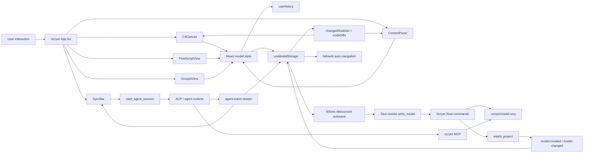
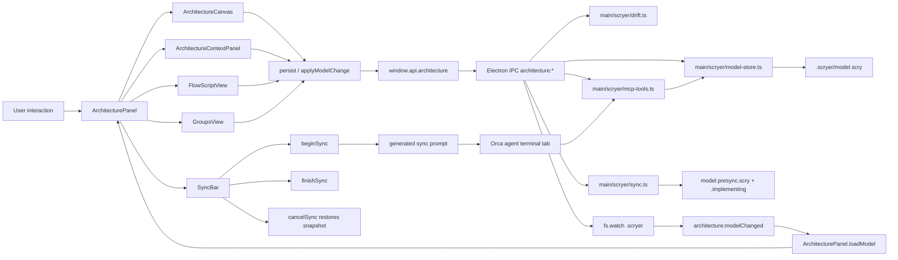
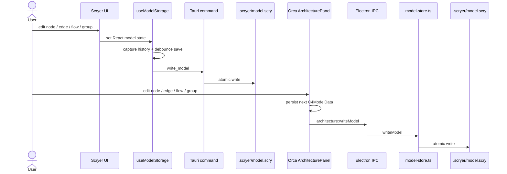
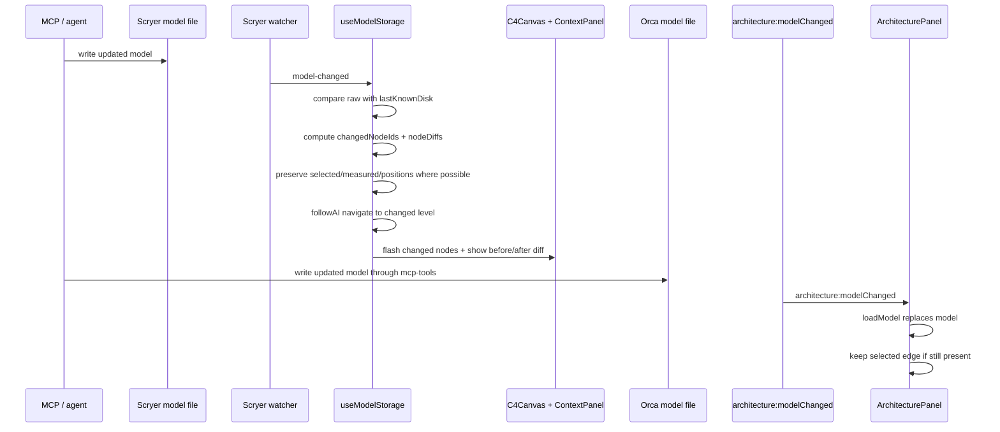
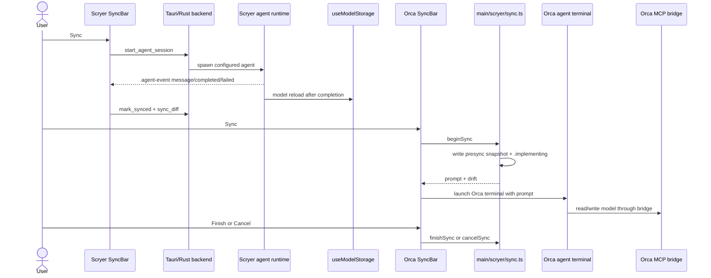
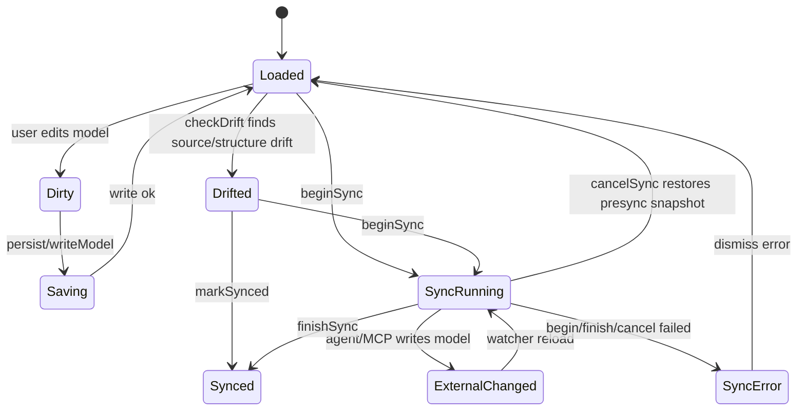

# orca-scryer UML 差异分析

生成时间：2026-05-11

本文用 UML 风格对比 Scryer 原始实现和当前 Orca 迁移实现，重点不是看某个按钮是否存在，而是看“人类操作前端 -> 前端状态变化 -> 后端持久化 -> agent/MCP 外部改写 -> 前端重新理解状态”的完整链路。

## 结论

当前 Orca 迁移已经不是空壳：ReactFlow 画布、节点/边编辑、flow/group 编辑、source map、drift、MCP bridge、sync/cancel/finish 都走了真实 `.scryer/model.scry` 和 Electron IPC。

本轮已补上此前最大的结构性差距：Orca 现在有 `useArchitectureModelController`，把模型读取、写入、文件监听、外部变更 diff、高亮、follow 外部变更、撤销/重做、drift、sync/cancel/finish 和 Orca agent 完成状态监听集中到一个前端控制层。它不是照搬 Scryer 的 Tauri/Rust 链路，而是把同一套状态语义接进 Orca 原生 tab/store/IPC/agent terminal。

仍需注意：当前目标是功能链和人类交互链对齐，不是逐像素复刻。比如 group bubble 已按成员位置真实计算并渲染 overlay，但没有引入 `bubblesets-js` 做有机曲线；AI provider 仍按要求走 Orca agent，不迁移 Scryer 独立 provider。

## 1. Scryer 原始前后端链路

Scryer 的关键点：

- UI 组件只负责交互，模型读写集中进 `useModelStorage`。
- `useModelStorage` 用 `lastKnownDisk` 避免自己写文件后又重复 reload。
- 外部 MCP/agent 改写文件后，watcher 触发 reload，再计算 changed nodes、旧值 diff、父层级变化和 follow AI 导航。
- `useHistory` 捕获同一份模型状态，所以 nodes、edges、sourceMap、groups、flows 可以一起 undo/redo。
- sync 不是只显示状态条，后端 agent runtime 会发 `agent-event`，前端根据 completed/cancelled/failed 自动 mark synced、reload model、展示 diff。

## 2. 当前 Orca 迁移链路

Orca 当前做对的地方：

- 没有迁移 Scryer Tauri 外壳，而是接入 Orca 原生 tab、preload、Electron IPC、store、agent terminal。
- MCP bridge、drift、model-store、sync snapshot 都是真实 TypeScript/Node 逻辑，不是 mock。
- `beginSync` 写 pre-sync snapshot 和 `.implementing`，所以切换 tab、重启后还能恢复 sync 中状态。
- source map 直接打开 Orca editor，不再走 Scryer 的独立 `open_in_editor`。
- `useArchitectureModelController` 已集中管理模型状态、外部变更 diff/follow、undo/redo 和 sync 生命周期。
- sync 已接 Orca agent 状态：新开的 agent tab 报告非中断 `done` 时自动 `finishSync`，更新 baseline 并清除 `.implementing`。

主要剩余差距：

- group bubble 目前是按节点范围计算的 ReactFlow overlay，未做 `bubblesets-js` 的有机曲线形状。
- Scryer 的独立 AI advisor/provider 按用户要求不迁移；如果以后要“AI 填充节点”，应该接 Orca agent 能力，而不是新增 provider 设置。
- 外部 stdio MCP server 仍可后置；当前 Orca 内置 MCP bridge 已能真实读写模型。

## 3. 编辑保存时序对比

Orca 已补齐的逻辑：

- `persist/applyModelChange/loadModel/watchModel` 已抽成 `useArchitectureModelController`。
- 节点、边、flow、group、source map 修改都通过 controller 写入 `.scryer/model.scry`。
- controller 维护 `lastKnownModelFingerprint`、`changedNodeIds`、`nodeDiffs`、follow external changes、undo/redo、sync terminal tab 和 agent done 自动 finish。

## 4. 外部 MCP/agent 写入刷新对比

这里已从“文件级 reload”推进到“模型级理解”：Orca 会比较前后模型，生成 changed node、高亮、旧值 diff，并在 follow external changes 打开时跳到变化节点所在层级。live e2e 已覆盖 MCP 写节点后 UI 自动显示 changed glow 和 before/after diff。

## 5. Sync/drift 时序对比

Orca 的差异不是错误，而是适配 Orca agent 体系后的自然结果：agent 生命周期归 Orca terminal 管，不归 Scryer runtime 管。本轮已对齐关键闭环：架构 tab 记录自己启动的 agent terminal tab，并监听 Orca `agentStatusByPaneKey`；该 tab 报告非中断 `done` 时自动 `finishSync`。用户仍可在异常或中断场景下手动 finish/cancel。

## 6. 模型状态机

Scryer 已经把 `ExternalChanged` 的前端表现做得更细：高亮、diff、自动跳转、保留布局。Orca 当前只完成了文件级 reload。

## 7. 差异清单

| 模块           | Scryer 原始逻辑                                                        | Orca 当前状态                                                 | 结论                                               |
| -------------- | ---------------------------------------------------------------------- | ------------------------------------------------------------- | -------------------------------------------------- |
| 模型保存       | `useModelStorage` 集中保存，500ms debounce，跳过 sync 中保存           | `useArchitectureModelController` 集中读写 IPC                 | 已对齐核心链路                                     |
| 文件监听       | `watch_project` + `model-created/model-changed` + `lastKnownDisk` 去重 | `fs.watch .scryer` + fingerprint 去重 + controller reload     | 已对齐 Orca IPC 链路                               |
| 外部变更理解   | `changedNodeIds`、`nodeDiffs`、followAI、位置保留                      | changed glow、before/after diff、follow external changes      | 已迁移核心语义                                     |
| undo/redo      | `useHistory` 捕获完整模型状态                                          | controller 捕获完整 `C4ModelData`                             | 已覆盖 nodes/edges/sourceMap/groups/flows 写入链路 |
| ContextPanel   | 支持 node/edge/group、diff 展示、contract/source map/relationships     | node/edge/group 编辑、diff 展示、contract/source map/关系编辑 | 已迁移主要交互                                     |
| FlowScriptView | steps、branches、mention、source map、排序                             | steps/branches/mention/source link/排序并持久化               | 已迁移主要交互                                     |
| GroupsView     | dnd、成员、嵌套、canvas groups 模式                                    | dnd、成员、嵌套、multi-select 建组、canvas group overlay      | 已迁移主要交互                                     |
| SyncBar        | agent-event 自动更新日志、完成后 mark synced/reload/sync_diff          | Orca terminal prompt + finish/cancel + agent done 自动 finish | 已接 Orca agent 状态                               |
| drift          | Rust 检测 source map 和结构变化                                        | TypeScript 检测 source map 和结构变化                         | 已有真实逻辑，继续扩大 e2e                         |
| MCP            | 外部 stdio MCP + Scryer runtime                                        | Orca 内置 MCP bridge                                          | 内置 bridge 已真实可用，外部 stdio 可后置          |
| AI advisor     | Scryer 独立 provider、hints、fill with AI                              | 按要求未迁移                                                  | 不迁移独立 provider；可接 Orca agent 能力          |
| Tauri shell    | Tauri desktop app                                                      | 按要求未迁移                                                  | 正确舍弃                                           |

## 8. 仅为测试通过的风险点排查

目前没有发现“完全空壳”的核心链路：画布、FlowScriptView、GroupsView、SyncBar、MCP bridge、drift 和 sync snapshot 都有真实读写路径。

目前仍有几类“不是空壳，但要诚实记录”的差异：

1. group bubble 是真实成员范围 overlay，但还不是 `bubblesets-js` 有机曲线。
2. AI provider 不迁移是明确边界；如果要 AI fill，需要走 Orca agent，而不是 Scryer provider。
3. 外部 stdio MCP server 未拆出；当前内置 MCP bridge 已覆盖 Orca agent 使用路径。
4. 视觉密度和细节仍可能和 Scryer 有差异，但主要交互、状态管理、持久化和 live e2e 已覆盖。

这些不是“假代码”，也不是为了测试通过写的空壳；它们是后续像素级/外部集成级增强项。

## 9. 第二阶段细粒度迁移清单完成情况

1. 新增 `useArchitectureModelController`
   - 输入：`projectPath`、当前 tab/worktree 信息。
   - 输出：`model`、selection、expandedPath、activeFlowId、dirty/saving/error、changedNodeIds、nodeDiffs、followAI、undo/redo、所有 mutation 方法。
   - 迁移现有 `loadModel/persist/applyModelChange/watchModel` 到 controller。
   - 状态：已完成。单元测试覆盖空模型、fingerprint 和 agent done 判定；live e2e 覆盖 controller 真实读写链。

2. 迁移 Scryer 外部变更 diff 链
   - 记录 `lastKnownDisk`。
   - watcher reload 时比较旧/新 nodes 和 edges。
   - 生成 `changedNodeIds` 和 `nodeDiffs`。
   - Canvas 节点闪烁，ContextPanel 展示旧值/新值。
   - 状态：已完成核心链。live e2e 已通过 MCP 改节点状态并显示 changed glow 和 diff。

3. 迁移 follow AI / follow agent 导航
   - 保留用户开关。
   - 外部变更落在 container/component 子层级时自动切换 expandedPath。
   - 多层级同时变化时按 Scryer 逻辑选择较浅层级。
   - 状态：已完成外部变更 follow 开关和层级跳转；后续若接独立 AI fill，再接 Orca agent。

4. 迁移模型 undo/redo
   - 迁移 `useHistory` 思路，但适配 Orca controller。
   - 快捷键需避开 Orca 全局快捷键冲突。
   - 覆盖 nodes、edges、sourceMap、groups、flows。
   - 状态：已完成 controller history；live e2e 覆盖 code-level 节点修改撤销/重做。

5. 补 ContextPanel diff 和 group context
   - 节点 diff old/new 展示。
   - group identity、contract、members 编辑链路对齐 Scryer。
   - 状态：已完成主要交互；live e2e 覆盖 selected group 编辑说明和 contract ask。

6. 补 SyncBar 与 Orca terminal 生命周期联动
   - 不迁移 Scryer 独立 agent runtime。
   - 研究 Orca terminal/agent 状态源，监听 agent 完成/取消/失败。
   - 完成时自动 `finishSync`、reload model、check drift。
   - 状态：已完成 agent `done` 自动 finish；失败/中断仍保留人工 review/cancel 路径。

7. 补 group bubble 和 CodeLevelRack 视觉逻辑
   - group bubble 要真实根据成员节点位置计算，而不是静态背景。
   - 状态：已完成真实成员范围 overlay 和 component 代码层级 rack；未做 `bubblesets-js` 有机曲线。

8. 扩展 live e2e
   - 人类操作：创建/编辑/撤销/重做节点、边、flow、group。
   - agent 操作：MCP 写入多层级节点，UI diff/highlight/followAI。
   - sync 操作：begin -> agent 写 model -> 自动/手动 finish -> baseline 更新 -> drift 清空。
   - 状态：已覆盖画布、边、flow、group、source map、drift、sync/cancel、agent done 自动 finish、重启恢复。

## 10. 本轮 Orca 适配经验

- Tauri `invoke` 不应该原样搬进 Orca；正确做法是 `preload API -> Electron IPC -> main TypeScript service`。
- Scryer 的 AI provider 不迁移，但 Scryer 的模型语义、MCP 工具语义、drift/sync 语义要保留。
- React 事件里直接读 state 容易读到旧值；像 source pattern、sync reload 这类路径要用 ref 或 controller 避免 stale state。
- sync 中要有硬状态文件：`.implementing` 和 `model.presync.scry`，否则切 tab 或重启后 UI 会误以为没有任务在跑。
- e2e 不能只点按钮，要读回 `.scryer/model.scry` 或通过 IPC/MCP 验证真实文件变化。
